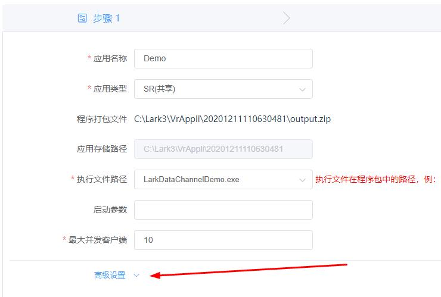
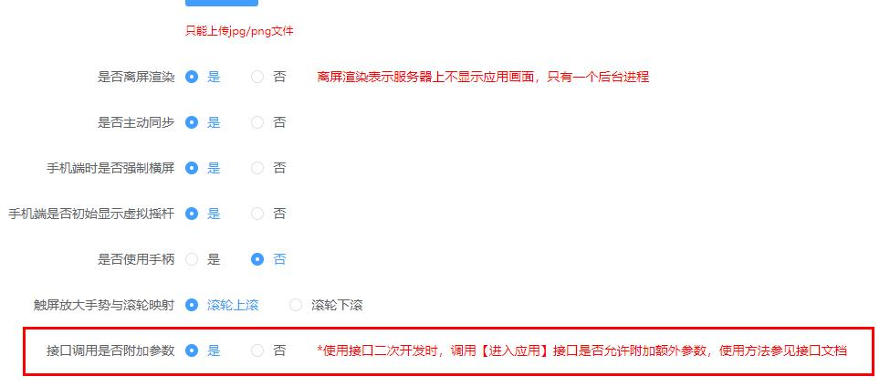

# 使用预发布的 Lark Plugin 接入

插件版本：lark_plugin_unity_2019V1.0.0.unitypackage

插件发布环境 Unity3D 2019.4.41f1 windows 版

插件功能

1. 管理和连接数据通道服务

## 导入和使用插件

### 导入插件

* 菜单栏选择 Assets->ImportPackage->Custom Package


* 找到 lark_plugin_unity_2019V1.0.0.unitypackage 文件存放位置并打开

* 勾选全部文件点击 Import


### 开始使用

* 在 Lark/Scripts/ 下找到 LarkManger 脚本


* 创建 empty object 并将 LarkManger 脚本挂载上


通过 LarkManger 实例即可调用插件提供的接口。如获取 TaskId

```cs
lark.LarkManager.Instance.TaskId
```

#### 数据通道服务

首先设置代理

```cs
// 连接数据通道成功
public delegate void OnConnected();
// 收到文本消息
public delegate void OnTextMessage(string msg);
// 收到字节消息
public delegate void OnBinaryMessaeg(byte[] binary);
// 数据通道关闭
public delegate void OnClose(ErrorCode code);
```

通过 LarkManeger 实例获取 DataChannelNativeApi 实例并设置代理

```cs
lark.LarkManager larkManager = lark.LarkManager.Instance;
larkManager.DataChannel.onConnected += OnConnected;
larkManager.DataChannel.onText += OnTextMessage;
larkManager.DataChannel.onBinary += OnBinaryMessaeg;
larkManager.DataChannel.onClose += OnClose;
```

开始连接. LarkManger 会自动从命令行最后一位读取 TaskId，调用开始连接接口

```cs
lark.DataChannelNativeApi.ApiRestult restult = lark.LarkManager.Instance.StartConnect();
```

发送字符消息

```cs
public void SendText(string txt)
{
    lark.LarkManager.Instance.Send(txt);
}
```

发送字节消息

```cs
public void SendBinary(byte[] data)
{
    lark.LarkManager.Instance.Send(data);
}
```

### Demo 场景

Demo 场景封装了基本使用流程，可配合 Web 客户端 Demo 一起使用。演示通过数据通道发送 json 封装指令等。


### 打包和发布

#### 打包

发布成 PC 版并发布到云雀系统上进行测试，并注意选择窗口全屏，*不要*选择独占全屏.


#### 上传

登录云雀后台，选择应用管理，添加应用


选择上传绿色版本


把发布好的应用程序压缩成一个 zip 文件并上传


填写基本信息，并打开高级设置选项



接口调用是否附加参数选择*是*。

> 注意着一步如果不选择的应用里无法获取 TaskID，没法启动数据通道服务



点击保存上传完成。
